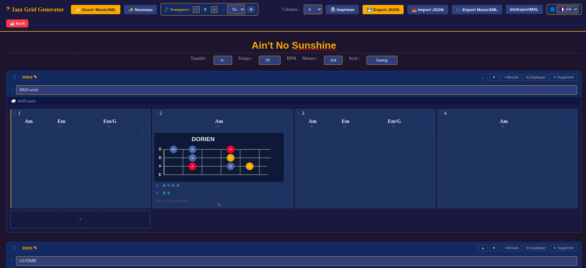
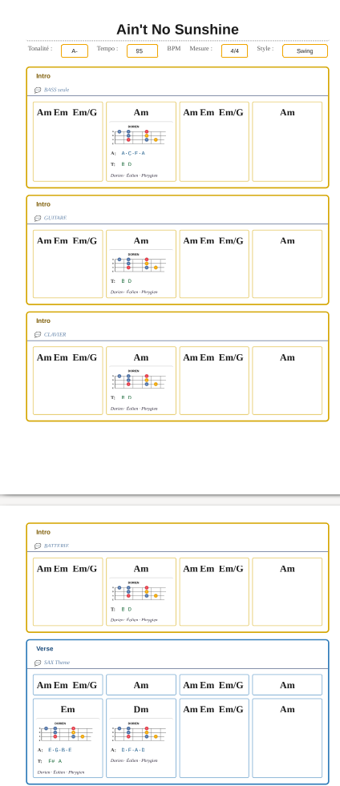

# 𝄢 Jazz Grid Generator

> An online jazz chord chart editor with music theory annotations, 4- and 5-string bass fretboard diagrams, MusicXML import/export and print-optimised PDF output.


[](https://ko-fi.com/lorenzovirgosfrediani)

> 🇫🇷 [Version française → README.md](README.md)

---

## ✨ Features

- 📂 **MusicXML import** — drag & drop or file picker; `.musicxml`, `.xml`, `.mxl` (compressed) formats
- ✏️ **Full chord editing** — 17 roots, 24 qualities, slash bass, free-form input, per-chord beat duration
- 🎵 **iReal Pro measure symbols** — `%`, `𝄎`, `N.C.`, `/`, `(w)` (invisible root — bass only)
- 🎼 **Rich barlines** — plain, double `‖`, final `𝄂`, repeat `|:` `:|`
- 🔂 **Voltas** (1st / 2nd / 3rd ending) — visual bracket + MusicXML export
- 🧭 **Navigation symbols** — Segno `𝄋`, Coda `𝄌`, D.C./D.S. al Coda, Fine, Fermata `𝄐`
- 🔀 **Alternate chord** — tritone substitution with automatic suggestion for dominant chords
- 🎼 **Music theory annotations** — mode + SVG fretboard diagram (4- or 5-string), 4-note arpeggios, tensions, free notes
- 🎸 **4🎸 / 5🎸 toggle** — toolbar switch between 4-string (EADG) and 5-string (BEADG) fretboard diagrams
- 🎵 **Transposition** — by semitone (±) or target key, automatic enharmonic spelling
- 🗂️ **Customisable section labels** — letters A–I, keywords (Intro, Chorus…) + suffixes `'` `''` `1`–`9` `0`
- 📐 **Move sections and measures** — drag & drop + ▲▼ ◀▶ buttons
- ↩️ **Undo / Redo** — 10 levels, Ctrl+Z / Ctrl+Y, ↩ ↪ toolbar buttons
- 📱 **Tablet touch support** — finger drag & drop, pinch-to-zoom
- 🎨 **Custom section colour** — 15 preset swatches, free colour picker, live indicator, auto reset
- 🖨️ **Print / PDF** — light/dark theme, contrast (5 levels), per-section colours; adaptive layout for dense measures
- 💾 **JSON save** — full fidelity including all annotations
- 🎼 **MusicXML / MXL export** — compatible with MuseScore, Sibelius, Finale
- 🌐 **4 languages** — FR 🇫🇷 ES 🇪🇸 IT 🇮🇹 EN 🇬🇧

---

## 📸 Screenshots

<div align="center">
  
  <br><em>Main interface — toolbar and MusicXML drop zone</em>
</div>
<br>
<div align="center">
  
  <br><em>Chart with Dorian mode annotation and bass fretboard diagram</em>
</div>
<br>
<div align="center">
  
  <br><em>PDF output — light theme with automatic section colours</em>
</div>

---

## 🚀 Quick Start

```bash
git clone https://github.com/virgosfredianilorenzo-cyber/Jazz_grid_generator.git
cd Jazz_grid_generator
open index.html   # macOS — or double-click on Windows/Linux
```

Or host on **GitHub Pages**, **Netlify**, **Vercel** — no configuration needed.

---

## 🎵 User Guide

### Section Labels

Click the label in the top-left corner of any section to open the label modal:

- **Main letter**: `A` `B` `C` `D` `E` `F` `G` `H` `I` · `Intro` `Verse` `Chorus` `Bridge` `Outro` `Coda` `Tag` `Vamp` `Head`
- **Suffix**: `(none)` · `'` · `''` · `1` `2` `3` `4` `5` `6` `7` `8` `9` `0`

Examples: `A`, `A'`, `A1`, `B3`, `Chorus2`, `Verse7`, `Head0`…

### Undo / Redo

| Action | Keyboard shortcut | Toolbar button |
|--------|-------------------|----------------|
| Undo | Ctrl+Z (⌘Z Mac) | ↩ |
| Redo | Ctrl+Y / Ctrl+Shift+Z (⌘Y Mac) | ↪ |

10 history levels. Full coverage: chords, annotations, sections, measures, barlines, voltas, navigation, alt chords, drag & drop. **✨ New** resets the history.

### Tablet Touch Support (iPad / Android)

| Gesture | Action |
|---------|--------|
| Tap | Open edit modal |
| Hold + drag ⠿ | Move a section or measure |
| Pinch (two fingers) | Zoom in / out (0.5× – 2×) |

Interactive targets (⠿ handles, edge buttons, chord slots) are automatically enlarged on touch screens via `@media (pointer: coarse)`.

### iReal Pro Measure Symbols

In the chord modal, the **QUICK SYMBOLS** panel:

| Symbol | Meaning |
|--------|---------|
| `%` | Repeat the previous measure |
| `𝄎` | Repeat the previous 2 measures |
| `N.C.` | No Chord |
| `/` | Beat slash |
| `(w)` | Invisible root — bass only, no harmony written |

### Alternate Chord

On hover → **`♯±`** button → type chord → **✓**. For dominant chords (e.g. `G7`), the tritone substitution is suggested automatically (`Db7`). Click the displayed alt chord to edit or delete it. MusicXML export: `<harmony print-frame="no"><footnote>alt</footnote>`.

### Barlines, Voltas and Navigation

**◧ ◨** on measure hover for barlines and voltas. **𝄌** button top-right for navigation symbols. All exported and imported via MusicXML.

| Barline type | Visual | MusicXML |
|-------------|--------|----------|
| Normal | `\|` | *(default)* |
| Double | `‖` | `light-light` |
| Final | `𝄂` | `light-heavy` |
| Repeat start | `\|:` | `<repeat direction="forward"/>` |
| Repeat end | `:\|` | `<repeat direction="backward"/>` |

| Nav symbol | Displayed | MusicXML |
|-----------|-----------|----------|
| Segno | `𝄋` | `<segno/>` |
| Coda | `𝄌` | `<coda/>` |
| D.C. al Coda | text | `<words>` + `<sound/>` |
| D.S. al Coda | text | `<words>` + `<sound/>` |
| Fine | text | `<words>Fine</words>` |
| Fermata | `𝄐` | `<fermata/>` |

### Importing a MusicXML File

Drag & drop a `.musicxml`, `.xml` or `.mxl` file onto the drop zone, or click **📂 Open MusicXML**. Imported data: chords, alt chords, key, tempo, sections, barlines, voltas, navigation symbols.

### Save and Export

| Format | Purpose |
|--------|---------|
| **JSON** | Full save (annotations included) — always prefer this |
| **MusicXML** | Share with MuseScore, Sibelius, Finale |
| **MXL** | Compressed format |

> **Tip:** Always use JSON to save your work. MusicXML export does not include theory annotations.

### Transposition

| Control | Description |
|---------|-------------|
| **− / +** buttons | Transpose ±1 semitone |
| Key dropdown | Transpose directly to a target key |
| **↺** reset | Restore the original key |

### Print / PDF

1. Click **🖨️ Print**
2. Choose **theme** (light ☀️ / dark 🌙)
3. Adjust **contrast** (1–5)
4. Click **Print** → **Save as PDF**

The layout adapts automatically to measure density: with 2+ chords per measure, font sizes are reduced, arpeggios display in a 2-column grid (all notes visible), tensions fit on one line, and mode names stack vertically. Handle icons and section colour buttons are hidden.

---

## 🎼 Music Theory Engine

**24 chord qualities** · **16 modes** with dynamic SVG diagrams · 4-note arpeggios with inversions · Tensions

| Quality | Compatible modes |
|---------|-----------------|
| `maj7` | Ionian, Lydian |
| `7` | Mixolydian, Lydian b7, Altered, Mixo b9b13 |
| `m7` | Dorian, Aeolian, Phrygian |
| `m7b5` | Locrian, Locrian #2 |
| `dim7` | Half-whole diminished |
| `mM7` | Melodic minor |

Diagram colour coding: 🔴 Root · 🟠 Arpeggio · 🔵 Scale

---

## 🗂️ Project Structure

```
Jazz_grid_generator/
├── index.html      # Complete application (single file)
├── README.md       # French version
├── README.en.md    # This file (English)
├── LICENSE         # Apache 2.0
└── Screenshots/
```

| JS/CSS Block | Content |
|-------------|---------|
| `CSS — APP` | Layout, measures, symbols, touch |
| `CSS — MODALS` | Modals |
| `CSS — PRINT` | @media print |
| `JS — I18N` | FR/ES/IT/EN translations |
| `JS — SVG DIAGRAMS` | Fretboard diagrams |
| `JS — THEORY ENGINE` | Scales, arpeggios, tensions |
| `JS — PARSER` | MusicXML import |
| `JS — RENDER` | DOM rendering |
| `JS — MODALS` | Modals + popups |
| `JS — ACTIONS` | add / delete / duplicate / move |
| `JS — I/O` | JSON + MusicXML + MXL |
| `JS — UNDO/REDO` | 10-snapshot stack |
| `JS — TOUCH SUPPORT` | Touch drag & drop + pinch-to-zoom |

---

## 🛠️ Customisation

| What | Where |
|------|-------|
| Undo history depth | `UNDO_MAX` constant in `JS — UNDO/REDO` |
| Add a section suffix | `suffixVals[]` (×2) + `suffixLabels[]` (×4 languages) |
| Add a measure symbol | `isSpecialSym()` · `getSymClass()` · `getSymLabel()` · CSS · `SYMS[]` · `harmonyToXML()` |
| Add a chord quality | `QUALITIES[]` · `ARP_DEF` · `MODES_DEF` · `TENS_DEF` |
| Add a language | Entry in `LANGS` + `<option>` in `#lang-select` |

---

## 🎸 Designed for Bass Players

- **Arpeggio inversions** — exact note order for each position on 4 strings EADG
- **5-string BEADG diagrams** — 7 diatonic modes, hand-validated fingerings, 4🎸/5🎸 toolbar toggle
- **Tensions as real pitch names** — e.g. *b9 → D♭* on C7, not just the interval
- **Dynamic SVG fretboard diagrams** — instant visual reference at the music stand
- **`(w)`** for bass-only passages with no written harmony
- **Adaptive PDF** — font and layout automatically scaled for busy measures
- **Pinch-to-zoom** to fit the grid on a tablet stand
- **Undo/Redo** to experiment freely

---

## 🤝 Contributing

```bash
git checkout -b feature/my-improvement
# Edit index.html — test in browser (no build step)
git commit -m "feat: describe your change"
git push origin feature/my-improvement
# Open a Pull Request
```

Commit prefixes: `feat:` `fix:` `style:` `refactor:` `docs:` `i18n:`

---

## 📝 Changelog

### 4.10
- 🖨️ **Adaptive PDF layout** — from 2 chords per measure: automatic font reduction, arpeggios displayed in a 2-column grid (all notes fully visible), tensions condensed to one line, mode names stacked vertically; progressive reduction for 3 and 4 chords per measure
- 🧭 **Smart context menus** — barline, navigation symbol and alternate chord popups always stay on screen: automatic left-shift and upward repositioning when content would overflow
- 🖨️ **Hidden print elements** — section and measure drag handles, and the section colour button, are now hidden in PDF output

### 4.9
- 🎸 **5-string BEADG fretboard diagrams** — 7 diatonic modes (Ionian→Locrian), hand-validated fingerings, consistent across all strings
- 🔀 **4🎸 / 5🎸 toggle** — toolbar button; instant switch between 4- and 5-string diagrams; global persistent state

### 4.8.2
- 🎨 **Custom section colour picker** — 🎨 button in each section header; popup with 15 preset swatches + free colour input; live indicator (coloured left border in editor); colour applied at print time and in the preview panel; reset button to restore automatic palette; integrated with Undo/Redo history

### 4.8.1
- ✨ **Extended section suffixes** — digits `3` through `9` and `0` added to the suffix picker; labels like `A3`, `Chorus7`, `Head0` are now possible

### 4.8
- ↩️ **Undo / Redo** — 10-snapshot stack, Ctrl+Z/Y (⌘Z/Y Mac), ↩ ↪ buttons; full mutation coverage
- 📱 **Tablet touch support** — Touch Events drag & drop, MutationObserver post-render patching, pinch-to-zoom, `@media (pointer: coarse)` enlarged targets

### 4.7
- ✨ **`(w)` Invisible root** — bass-only symbol; MusicXML export as `<direction><words>(w)</words></direction>`

### 4.6
- ✨ **Alternate chord** — automatic tritone sub suggestion; MusicXML export/import

### 4.5
- ✨ **Rich barlines**, **Voltas**, **Navigation symbols** — MusicXML export/import

### 4.4
- ✨ **iReal Pro symbols** `%` `𝄎` `N.C.` `/` — QUICK SYMBOLS panel

### 4.3 / 4.2
- ✨ Drag & drop for sections and measures

### 4.1 · 4.0 · 3.0
- 🐛 PDF fix · ✨ SVG diagrams + MXL · ✨ 4 languages + JSON + MusicXML + Transposition

---

## 📋 Roadmap

- [x] Drag & drop sections and measures
- [x] SVG bass fretboard diagrams (16 modes, 4 strings)
- [x] MXL import/export
- [x] All iReal Pro symbols (`%` `𝄎` `N.C.` `/` `(w)`)
- [x] Rich barlines, Voltas, Navigation symbols
- [x] Alternate chord
- [x] Undo / Redo (10 levels)
- [x] Tablet touch support
- [x] Extended section suffixes (0–9)
- [x] 5-string bass (BEADG) fretboard diagrams — 4🎸/5🎸 toggle
- [x] Adaptive PDF layout for dense measures
- [ ] MIDI playback of root notes
- [x] Custom colour picker per section

---

## ☕ Support the Project

[](https://ko-fi.com/lorenzovirgosfrediani)

---

## 📄 License · 🙏 Credits

**Apache 2.0** · Vanilla HTML/CSS/JS · [MusicXML W3C](https://www.w3.org/2021/06/musicxml40/) · [JSZip 3.10.1](https://stuk.github.io/jszip/)

---

*𝄢 Made with love for musicians, by a bass player.*
