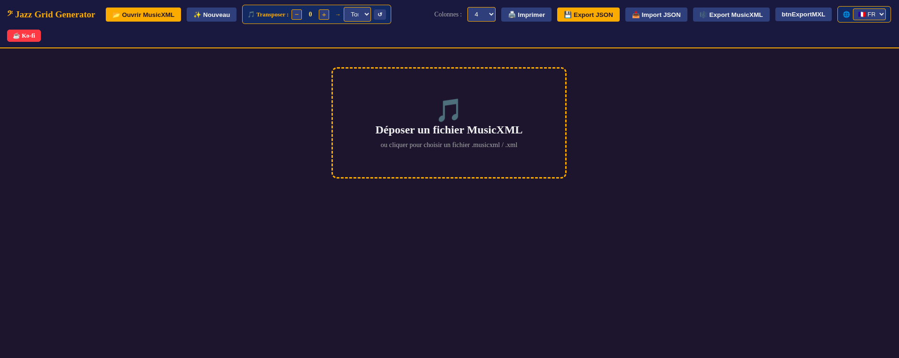

# 𝄢 Jazz Grid Generator

> Éditeur de grilles jazz en ligne — assistant IA, théorie musicale, diagrammes de manche basse, import/export MusicXML, sortie PDF.


**🌐 Démo live** : https://www.virgos.fr/JazzGridGenerator/



Crée des grilles jazz à partir d'un document vierge ou depuis un fichier MusicXML (iReal Pro®, MuseScore®…). Édite, transpose, annote, puis exporte en PDF — prêt à utiliser sur ta tablette lors de concerts ou jam sessions.

---

## ✨ Fonctionnalités

- 🤖 **Assistant IA conversationnel** — panneau en bas de page, piloté en langage naturel : crée, modifie et supprime sections, mesures, accords et annotations ; transpose tout le chart ; aperçu avant application avec boutons Appliquer / Annuler
- 📂 **Import MusicXML** — drag & drop ou sélecteur de fichier ; parse les accords, sections, barres de reprise, tonalité, tempo (iReal Pro®, MuseScore®, Sibelius, Finale…)
- 📦 **Import / Export MXL** — format MusicXML compressé
- ✏️ **Édition complète des accords** — 17 fondamentales, 24 qualités, basse en slash, saisie libre, durée par accord
- 🔄 **Accord alternatif** — substitution tritoniée avec suggestion automatique
- 🎼 **Annotations de théorie musicale** par accord : modes compatibles, arpèges à 4 sons avec inversions, tensions disponibles, notes à éviter, notes libres
- 🎸 **Diagrammes de manche basse 4 et 5 cordes** — toggle 🎸 4/5 dans la toolbar ; 17 modes en 5 cordes (BEADG) ; transposition automatique selon la fondamentale ; 🔴 fondamentale · 🟡 arpège · 🔵 autres degrés
- 🎵 **Transposition** — par demi-ton (±) ou sélection directe de tonalité, avec gestion enharmonique
- 🗂️ **Gestion des sections** — labels (A–I, Intro, Verse, Chorus, Bridge, Coda…), suffixes chiffrés, dupliquer, réordonner, annoter ; ID unique `#xxxx` dans l'en-tête
- 🔀 **Drag & drop** — sections et mesures déplaçables à la souris et au toucher
- 🎵 **Symboles de mesure** — `%`, `𝄎`, `N.C.`, `/`, `(w)` basse seule
- 🔢 **Barres de mesure enrichies** — normale, double, finale, reprise début/fin ; export/import MusicXML
- 🎼 **Voltas et symboles de navigation** — 1ère/2ème/3ème fois, Segno, Coda, D.C., D.S., Fine
- ↩️ **Annuler / Rétablir** — 10 niveaux, raccourcis Ctrl+Z / Ctrl+Y, couverture complète de toutes les actions
- 📱 **Support tactile tablette** — drag & drop au doigt, pinch-to-zoom, cibles agrandies
- 🖨️ **Impression / PDF avancée** — thème clair/sombre, contraste ajustable, colorisation par section, réduction de police automatique sur mesures multi-accords
- 💾 **Sauvegarde du travail en cours (JSON)** — reprise exacte à l'identique, accords, annotations et sections inclus
- 🎼 **Export MusicXML** — compatible MuseScore®, Sibelius, Finale, iReal Pro®
- 🌐 **4 langues** — Français 🇫🇷, Espagnol 🇪🇸, Italien 🇮🇹, Anglais 🇬🇧
- ⚡ **Sans build** — ouvre `index.html` directement dans un navigateur ; le cœur de l'app fonctionne hors ligne (MXL et IA nécessitent une connexion)

---

## 🤖 Assistant IA

Le panneau IA s'ouvre via l'onglet **✦ IA** en bas à droite de la page.

### Configuration

Cliquer **⚙** dans l'en-tête du panneau :

| Paramètre | Valeurs |
|-----------|---------|
| Provider | Claude (Anthropic) · OpenAI® |
| Modèle Claude | `claude-sonnet-4-6`, `claude-opus-4-7` |
| Modèle OpenAI® | `gpt-4o`, `gpt-4o-mini` |
| Clé API | Saisie dans l'app, stockée localement, jamais transmise ailleurs |

<details>
<summary>Outils disponibles</summary>

| Catégorie | Outils |
|-----------|--------|
| Chart | `set_chart_metadata`, `transpose_chart`, `set_columns`, `set_bass_strings` |
| Sections | `add_section`, `duplicate_section`, `rename_section`, `remove_section` |
| Mesures | `add_bar`, `duplicate_bar`, `remove_bar`, `set_barline` |
| Accords | `add_chord`, `edit_chord`, `remove_chord`, `set_chord_alt` |
| Annotations | `set_annotation` (avec `showSvg`), `toggle_all_diagrams` |

</details>

### Flux de travail

1. Écris une instruction en langage naturel
2. L'IA résume ce qu'elle va faire, puis appelle les outils nécessaires
3. Un aperçu liste les changements (*"Section B ajoutée"*, *"Dm7 → D7 mes. 3"*…)
4. **Appliquer** → modifications appliquées, snapshot undo créé
5. **Annuler** → rien ne change

---

## 🚀 Démarrage

**En ligne** — ouvre directement https://www.virgos.fr/JazzGridGenerator/

**En local** — clone le repo et ouvre `index.html` dans un navigateur. Aucun build, aucun serveur requis. MXL et IA nécessitent une connexion internet.

**Sur ton hébergeur** — dépose les fichiers sur n'importe quel hébergeur statique (Netlify, Vercel, Cloudflare Pages, Apache, Nginx…).

<details>
<summary>Architecture du projet</summary>

```
index.html
css/
├── app.css          ← styles UI, toolbar, toggle 4/5 cordes, panneau IA
├── modals.css       ← styles des modales
└── print.css        ← styles impression, réduction police multi-accords
js/
├── i18n.js          ← dictionnaire de traductions (FR/ES/IT/EN)
├── diagrams.js      ← SVG basse 4 et 5 cordes, transposition des diagrammes
├── theory.js        ← moteur de théorie (gammes, arpèges, tensions)
├── state.js         ← état global partagé entre les modules
├── render.js        ← rendu DOM de la grille
├── modals.js        ← modales accord et annotation
├── actions.js       ← mutations de la grille, auto-annotation à l'import
├── print.js         ← thème impression et colorisation par section
├── touch.js         ← support tactile (Touch Events, pinch-to-zoom)
├── ai.js            ← assistant IA (providers, outils, draft, chat, settings)
└── init.js          ← initialisation, restauration de la session
doc/
└── doc.html         ← documentation complète en ligne
```

</details>

---

## 🎸 Diagrammes basse

<details>
<summary>Modes disponibles en 5 cordes (17/17)</summary>

| Mode | Clé `diagrams.js` | Mode | Clé `diagrams.js` |
|------|-------------------|------|-------------------|
| Ionien | `Ionien_5` | Lydien b7 | `LydienB7_5` |
| Dorien | `Dorien_5` | Altéré | `Altere_5` |
| Phrygien | `Phrygien_5` | Mélodie mineure | `MelodieMineure_5` |
| Lydien | `Lydien_5` | Min. harmonique | `MinHarmonique_5` |
| Mixolydien | `Mixolydien_5` | Mixolydien b9b13 | `MixolydienB9B13_5` |
| Éolien | `Aeolien_5` | Lydien augmenté | `LydienAugmente_5` |
| Locrien | `Locrien_5` | Locrien #2 | `LocrienDiese2_5` |
| Dim. demi-ton | `DimDemiTon_5` | Dim. ton-demi | `DimTonDemi_5` |
| Tons entiers | `TonsEntiers_5` | | |

</details>

---

## ↩️ Annuler / Rétablir

<details>
<summary>Couverture complète</summary>

| Action | Couverte |
|--------|----------|
| Ajout / suppression / duplication d'accord | ✅ |
| Modification d'annotation | ✅ |
| Ajout / suppression / duplication de mesure | ✅ |
| Ajout / suppression de section | ✅ |
| Drag & drop section ou mesure | ✅ |
| Modification de barline | ✅ |
| Volta (1ère / 2ème / 3ème) | ✅ |
| Symbole de navigation | ✅ |
| Accord alternatif | ✅ |
| Application d'un draft IA | ✅ |

Profondeur : **10 niveaux**.

</details>

---

## 🎼 Théorie musicale

<details>
<summary>Modes suggérés par qualité d'accord</summary>

| Qualité | Modes suggérés |
|---------|---------------|
| `maj7` | Ionien, Lydien, Lydien augmenté |
| `7` | Mixolydien, Lydien b7, Altéré, Mixolydien b9b13 |
| `m7` | Dorien, Éolien, Phrygien, Min. harmonique |
| `m7b5` | Locrien, Locrien #2 |
| `dim7` | Dim. ton-demi, Dim. demi-ton |
| `mM7` | Mélodie mineure, Lydien augmenté, Min. harmonique |
| `aug` | Tons entiers |

</details>

---

## 📱 Support tablette

<details>
<summary>Détails techniques</summary>

- **Drag & drop tactile** — Touch Events sur sections et mesures
- **Pinch-to-zoom** — pincer la grille pour zoomer (0.5× à 2×)
- **Cibles agrandies** — `@media (pointer: coarse)` augmente les boutons barline, nav, accord
- **MutationObserver** — les éléments ajoutés après un render sont automatiquement patchés

</details>

---

## 🖨️ Impression / PDF

<details>
<summary>Réglages fins</summary>

**Mesures multi-accords**

| Nombre d'accords | Symbole | Zone théorie | Hauteur max |
|-----------------|---------|--------------|-------------|
| 2 accords | 0.72rem | 0.52rem | 2.6em |
| 3+ accords | 0.62rem | 0.44rem | 2.2em |

**Menus popup** — barlines, voltas et navigation se repositionnent automatiquement pour rester dans l'écran.

</details>

---

## 📋 Changelog

### v4.6 (mai 2026)
- ✅ Import MusicXML (`.musicxml`, `.xml`, `.mxl`) dans le Songbook, au même titre que les `.json` JGG
- ✅ Fix auto-scroll Songbook — la boucle rAF ne s'arrêtait plus immédiatement si l'iframe n'avait pas encore de contenu overflow

### v4.5 (mai 2026)
- ✅ Jazz Songbook — application compagnon (`songbook/`) : bibliothèque de morceaux, setlists, lecteur audio, auto-scroll réglable
- ✅ Intégration iframe JGG en mode view (`?mode=view`) depuis le Songbook
- ✅ BLE-MIDI — connexion HX Stomp, envoi Program Change + CC via Web Bluetooth
- ✅ IndexedDB — persistance locale songs/setlists/audioblobs
- ✅ Mode view JGG : masquage UI d'édition, navigation setlist précédent/suivant

### v4.4 (mai 2026)
- ✅ Avertissement avant fermeture de l'onglet si des modifications non sauvegardées sont en cours (flag `_isDirty`, listener `beforeunload`)

### v4.3 (mai 2026)
- ✅ ID unique par section (`#xxxx`), persisté en JSON, masqué à l'impression ; migration automatique des fichiers anciens
- ✅ Nouvel outil IA `toggle_all_diagrams`
- ✅ `set_annotation` expose `showSvg` pour contrôler la visibilité du diagramme
- ✅ Fix : export/import MXL restauré ; champs méta lisibles à l'impression

### v4.2 (mai 2026)
- ✅ Rendu Markdown dans les réponses IA — paragraphes, listes, **gras**, *italique*, `code`

### v4.0 (mai 2026)
- ✅ Assistant IA conversationnel — Claude et OpenAI®
- ✅ 15 outils IA : sections, mesures, accords, annotations, métadonnées, transposition
- ✅ Flux draft-preview-apply avec liste des changements et undo intégré
- ✅ Panneau IA en barre du bas, pleine largeur

→ [Historique complet](CHANGELOG.md)

---

## 📋 Feuille de route

- [ ] Lecture MIDI des notes fondamentales
- [ ] Sélecteur de couleur personnalisé par section
- [ ] Import iReal Pro® `.irealbook`

---

## 📄 Licence

Apache 2.0 — *𝄢 Made with love for musicians, by a bass player.*
